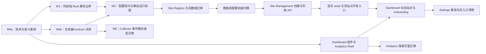

# 平台架构与 Dashboard 改进总规划

- Status: Proposed
- Scope: Site Management、运行时静态模型、站点接入、Dashboard UI 的协调实施
- Detailed designs: [M0a 现状基线](m0a-baseline-and-decisions.md)、[模块边界](analytics-site-management-module-boundaries.md)、[静态运行时模型](protocol-static-runtime-design.md)、[站点接入与 Settings](site-onboarding-settings-design.md)、[Dashboard UI](dashboard-ui-improvements.md)

## 目标与约束

本轮改进要让用户从空站点状态完成创建、安装和观测，同时使 Analytics 查询与 Site Management 在代码层面独立演进。四份子设计分别负责业务模块、数据契约、产品流程和界面；本文件规定它们的共同决策、实施顺序和跨任务验收。

目标状态：

1. `analytics-api` 可以继续是一个 Rust 进程，但其 `analytics` 与 `site_management` 是两个明确的 Rust `mod`，顶层只组合路由和基础设施。
2. PostgreSQL 可以继续是一个实例；Site Management 独占站点与运行配置的业务写入，Collector/Processor 分别承担事件接收与处理，Analytics 查询分析结果。
3. 数据库中的 Site Registry 与运行策略是平台的权威来源。平台环境变量只提供数据库地址、服务地址、部署管理凭据等基础设施配置；本地 seed 由显式 flag 启用。
4. `protocol/` 的 Schema 继续定义跨语言契约和 CI 校验；生产服务使用静态类型与显式运行时校验。
5. Dashboard 的 Analytics 和 Site Management client 分开；Header、Analytics Sidebar、Settings 二级导航及通用组件使用同一视觉基础。

本轮不以拆分进程、数据库实例或 PostgreSQL schema 为前提；也不引入多租户 RBAC、全新的分析指标或分析演示数据。

## 设计归属与共同规则

| 事项                                                   | 权威设计                                                   | 与其他任务的接口                                             |
| ------------------------------------------------------ | ---------------------------------------------------------- | ------------------------------------------------------------ |
| 业务边界、Rust `mod`、表的读写职责                     | [模块边界](analytics-site-management-module-boundaries.md) | 为新增 Site API 和静态类型确定 owner                         |
| Wire/storage 类型、Schema parity、运行时校验           | [静态运行时模型](protocol-static-runtime-design.md)        | 类型放在消费或 owner 模块；跨服务仅共享最小 runtime snapshot |
| Site Registry、创建事务、配置权威、seed、Settings 流程 | [站点接入与 Settings](site-onboarding-settings-design.md)  | 通过 Site Management API 给 Dashboard 提供站点和配置         |
| 组件主题、Header、Analytics 导航与报表页面             | [Dashboard UI](dashboard-ui-improvements.md)               | Settings 行为遵循站点接入设计，只复用视觉与页面骨架          |

### 模块与数据边界

- Site Management 是 Site Registry、capabilities、activation windows、environment policies、ingest key 摘要、definition revisions 和配置审计的目标写入 owner。当前 Processor 仍提供显式 `--import-definitions-if-empty` 命令，可从 `ANALYTICS_DEFINITIONS_FILE` 初始化 definition revisions；它属于旧数据导入路径，须在迁移后退出常规配置流程。
- Collector 插入 raw events；Processor 读取 raw events、更新处理标记并写入派生事实与聚合。Analytics 模块只查询这些数据。
- Conversion/funnel **定义**由 Site Management 管理；**处理与报表**由 Processor 和 Analytics 承担。跨域读取必须绑定 definition revision/version。
- `configuration-runtime` 是跨服务使用的运行时读取/快照代码，位于共享 crate；它不提供管理写操作，也不导出完整 Site Management 领域模型。`analytics-api` 内的 adapter 仅把该快照转换为 Analytics 所需的最小视图。
- 顶层应用可以共享 `PgPool`、日志、时钟等基础设施。两个业务 `mod` 不直接调用对方内部 handler、service 或 repository。

### 配置和契约边界

- Site 身份、Origin、capability、environment policy、key 和 definition revisions 以数据库为准。Collector TOML 的现有站点策略须在迁移核对后退出隐式 fallback；Processor 的 definitions 文件导入须收敛为一次性迁移工具并从常规开发/部署配置中移除。配置缺失不能让过期 key 或旧 definitions 重新生效。
- 平台 `.env` 不创建正式 Site 或平台 Ingest Key。被观测网站仍需配置公开的 Site ID、endpoint 和 Ingest Key；该网站的 SDK 配置不反向初始化平台数据库。
- 新 Site API 与存储文档先冻结字段、版本、错误、ETag 和未知字段规则，再实现静态类型和运行时校验。Schema 变更要与 Rust/TypeScript 类型、正负 fixtures 同步。
- 现有 Analytics 和管理 HTTP 路径在内部模块迁移时保持兼容。Dashboard 可配置两个逻辑 API URL，首期可指向同一个 `analytics-api` listener。
- 当前 deployment-admin token 仍是受信任管理环境的凭据。面向多用户公开使用前需另立身份和授权设计；管理 token 只留在 Dashboard 服务端。

## 首版语义基线（M0a 已冻结）

- 新 Site ID 由 Site Management 服务端生成稳定、不含名称或 URL 的标识；显示名称和 URL 可修改，也不作为唯一键。导入旧数据时保留原 Site ID。
- 新站点创建要求显示名称与 HTTP(S) 网站 URL；首个 environment 创建表单默认 `production` 且可修改，运行时不隐式默认 environment。显式开发 seed 使用 `development`。新 Site 默认仅开启必选 Page Views，其余能力初始关闭、由管理员选择并由服务端验证依赖；迁移既有 Site 保留其有效能力状态。
- 旧站点导入允许 URL 暂时缺失。Registry 的 `lifecycle_status`（active/archived）与管理 UI 使用的 `setup_status`（ready/needs_attention）分开；后者根据元数据和必要配置推导，不单独控制 Collector。缺少 URL 的旧站点若已有有效 policy 可继续采集；缺少 policy 的站点保留历史查询但不能接收新事件。
- 归档后 Collector 停止接收该 Site 的新事件，历史报告仍可查询。key 摘要与审计保留；恢复后管理员须显式确认或启用 environment policy，不能自动开放采集。
- 创建请求使用客户端生成的 `Idempotency-Key`，以唯一创建请求 ID 关联规范化请求摘要与 Site ID。相同 key/相同请求重试返回元数据，不重放明文 key；相同 key/不同请求返回冲突。该关联在 Site 生命周期内不设过期时间，Site ID 不得重用。首次响应丢失时管理员创建 replacement key。
- 部署管理员须先配置相互匹配的 `CONFIG_ADMIN_TOKENS` 与 `DASHBOARD_CONFIG_ADMIN_TOKEN`。它们是基础设施凭据。凭据缺失时 Dashboard 显示管理员设置错误，不把 401/503 当作空站点；当前全局 token 模式仅用于受信任的管理环境。
- M0b 对一个事件 contract 和一个配置 contract 试用类型生成器，再按 contract 类别选定生成或手工维护策略、未知字段行为与 CI 防漂移检查。

以上基线由 [M0a 现状基线与 ADR-013/014](m0a-baseline-and-decisions.md) 冻结。M5 新 API 的 wire contract 已在 M5.1 冻结并于 M5.2/M5.3 实施；M0b 类型生成策略和 M3/M4 迁移操作细节见相应切片。

## 实施依赖

图中的 `Y` 是独立技术线；站点接入不等待整个事件解析器替换。`U` 和 `V` 可与后端阶段并行，但需要使用已确定的导航与 site 参数 contract。`E` 是开放真实站点创建流程前的门槛；`S` 必须先于空站点 Dashboard 验收。

## 交付切片

每个切片应能独立 review、保留可运行状态，并在修改公开行为时同步更新 contract 与迁移说明。以下编号是本轮总计划的顺序，子设计中的 Phase/阶段编号仅描述各自内部步骤。

### M0a：现状基线与共同语义冻结

**状态：完成（2026-09-28）**。证据与决定见 [M0a 基线](m0a-baseline-and-decisions.md) 及 ADR-013/014。

**交付**

- 建立可追溯现状清单：现有路由/HTTP contract、表与读写者、配置来源、Schema 消费者、迁移/seed/显式导入来源及测试覆盖。
- 复用现有测试，并为关键既有管理/Analytics 行为补少量 characterization tests；未覆盖行为标记为后续切片工作，不扩建完整合同测试体系。
- 冻结 Site/Environment/Origin/key/definition revision 的领域语义、历史数据保留及迁移兼容规则；区分当前已实现行为与 Registry/API 的未来目标。
- 按主题新增 ADR-013（Site 身份与生命周期）及 ADR-014（运行配置权威与迁移边界），同步四份子设计的术语和决策状态。
- 新 Site API 的字段、错误 envelope、ETag 和幂等摘要 wire contract 留给 M5；事件/配置类型生成策略、未知字段及 CI 门禁留给 M0b。

**完成条件**：审计项均有代码、migration、test 或 protocol 文档证据；已冻结项有 ADR；未决项标注责任阶段；旧 API 搬迁基线可用于 M1 回归。

### M0b：静态类型生成器与 contract parity 试验

**状态：评估与决策完成（2026-09-29）**。结论与证据见 [M0b checklist](m0b-protocol-static-runtime-checklist.md)、[收尾摘要](m0b-final-summary.md) 和 [ADR-016](decisions/ADR-016-contract-type-sources-and-generation.md)。

**交付与结论**：已使用 Event Batch V1 和 Stored Environment Policy V1 评估 Schema → TS/Rust 类型生成、候选类型质量、Schema 外约束、运行时责任及 56 个 canonical fixtures 的跨语言 parity。当前生产接入策略为事件/配置 TS 使用 json-schema-to-typescript、policy Rust 使用 typify 加显式约束、事件 Rust 手工维护并做 parity。受测 Toolkit commit / SDK 0.7.0 不接入生产，但保留为长期优先改进候选；达到专项报告定义的四路径能力、wire 行为、完整诊断、parity 与可重复生成门槛后重新评估为主要工具。工具版本、逐阶段证据及差异见 checklist 链接的报告。

**后续实施**：生成物接入、固定工具版本、生成 `--check`、类型编译及 parity CI 门禁在 M2/M9 实施。M2 负责 policy 类型与显式校验、启动时构造并复用 policy validator，以及对 Collector date-time 差异作兼容决策。M9 负责事件静态类型迁移、Page View 扩展字段保留、可选字段 wire 序列化和 parity 验收。M0b 不替换生产类型、运行时校验或构建流程。

### M1：在现有进程内建立代码模块边界

**前置**：M0a。**交付**：`analytics`、`site_management` Rust `mod`、各自的 router/state/DTO/repository；顶层仅组装。先迁移现有 handler，保持 HTTP 路径和持久化行为。为跨域 definition/capability 读取确定只读 adapter，记录暂时保留的直接 SQL 依赖。

**完成条件**：两个业务模块不互相导入内部 handler/service/repository；原有 Analytics 和管理 API 的合同测试通过。此切片不增加 Site 创建功能。

### M2：收敛配置静态模型与 capability registry

**前置**：M0a、M0b、M1。**交付**：版本化存储配置类型、现有管理 API 请求类型、字段和跨字段校验、最小运行时快照及 capability registry。纳入 M0b 配置样本决策：固定并接入 json-schema-to-typescript/typify，提交产物并提供生成 `--check`；对 policy 增加显式约束和共享 fixture parity。Collector policy validator 在启动时构造并复用，保持 last-good/stale 语义。明确是否将当前接受的 Schema 无效 date-time 改为拒绝；作出兼容决策前不改变现有行为。先消除重复 validator 编译，再用正负 fixtures 对照 Schema 与静态实现，逐个切换现有配置读取与管理请求路径。

**完成条件**：JSONB/HTTP 输入继续完整校验；Collector、Processor、Analytics 只消费所需的静态运行视图；capability ID/依赖不在无校验列表中漂移。新 Site 创建请求类型在 M5 随冻结的创建 API contract 补充。

### M3：建立 Site Registry 并迁移旧站点

**前置**：M0a、M2 的存储 contract。**交付**：Site Registry migration、外键/引用策略、回填与核对工具。来源覆盖已有 capability/policy/definition 记录和历史分析数据中的 Site ID；无可靠 URL 的旧记录标记待确认，不从 Origin 静默推断权威 URL。导入记录的 `setup_status` 从缺失的元数据或配置推导，生命周期状态单独保存。

详细执行步骤、来源清单、恢复策略和验收项见 [M3 Site Registry checklist](m3-site-registry-checklist.md)。

**状态（2026-10-01）：** M3.1–M3.6 已完成本地开发目标的 Registry 盘点、导入、23 个 `ON DELETE RESTRICT` 引用 rollout 和验收。各部署目标仍须单独执行备份、预检、disposition 审核与 postflight；M4 权威切换尚未完成。

**完成条件**：旧站点在 Registry 中可见；有有效 policy 的旧站点可继续采集，缺失 policy 的站点保留历史查询且显示待补齐；原始事件、派生事实、definitions 和 key audit 保留；重复迁移或 importer 不产生重复站点。

### M4：切换平台运行配置权威

**前置**：M3。**状态（2026-10-01）：M4.1–M4.5 已完成本地开发目标实现与兼容验收；其他部署目标 rollout 尚未完成。** M4 面向单个部署目标逐一执行；本地开发目标记录不替代其他环境的预检、备份和审批。M4.3 closeout 见 [M4.3 Definitions Import Closeout](m4.3-definitions-import-closeout.md)，M4.4 closeout 见 [M4.4 Local DB-only Policy Closeout](m4.4-local-db-only-policy-closeout.md)，本地 M4.5 验收见 [M4 Runtime Configuration Authority Checklist](m4-runtime-configuration-authority-checklist.md)。

**执行顺序**：先完成目标环境备份和秘密安全的来源盘点；逐 Site/environment 核对数据库策略与旧 Collector TOML，保留必要 Origin/key/rate limit，必要时明确轮换无法验证的 key；核查 definitions 文件已导入 revisions；限定 Processor 文件导入并将 Collector Site policy 切为 PostgreSQL 唯一来源；最后执行配置状态、Collector、Processor 和 Analytics 的端到端验收。临时数据库故障的 last-known-good/stale 状态必须与策略明确缺失、停用或归档区分。本地对账记录见 [M4.2 Local Policy Reconciliation](m4.2-local-policy-reconciliation-plan.md)，运行时切换记录见 [M4.4 Local DB-only Policy Closeout](m4.4-local-db-only-policy-closeout.md)。

**交付**：数据库成为 Site identity、capability、environment policy、Origin、key digest 和 definition revision 的唯一运行时权威；TOML 保留基础设施设置，不再隐式授权 Site；definitions 文件仅能通过显式历史迁移操作读取；保留配置应用状态、审计、历史 Analytics 和可恢复的部署流程。详细切片和验收项见 [M4 runtime configuration authority checklist](m4-runtime-configuration-authority-checklist.md)。

**完成条件**：数据库配置缺失不会让 TOML 里的旧 Site/key 重新生效；停用和归档 Site 拒绝新事件；仅暂时数据库故障可使用带 stale 状态的 last-known-good；常规 Processor 启动不导入或覆盖 definitions；Collector、Processor 和 Analytics 能报告配置保存、应用及 stale 状态；保留的旧站点仍能按预期采集，历史报告可查询。

### M5：交付 Site Management 后端闭环

**前置**：M1、M3、M4。**状态**：完成（2026-10-01；验收记录见 [M5 Site Management Backend checklist](m5-site-management-checklist.md)）。**交付**：站点列表/详情/创建 API、原子创建事务、管理审计、并发与重复请求处理。创建事务包含 Registry、capabilities、activation windows、首个 environment policy、key digest、创建请求 ID 和规范化请求摘要。明文 key 只在首次成功创建响应中返回；重复 key/相同摘要返回站点元数据，重复 key/不同摘要返回冲突。现有 capabilities、policy、key、definition APIs 继续由 Site Management 维护。独立 Compose E2E 已验证新 Site 从创建、采集、处理到 Analytics 查询，并确认归档阻止新事件而保留历史报告。

**完成条件**：空数据库可通过管理 API 创建可接收事件的站点；失败时无半成品；重试不多建站点或重放明文 key；历史报告和现有 API 兼容。

### M6：交付空站点开发入口与 Dashboard 接入流程

**实施 checklist**：[M6 Site Onboarding Checklist](m6-site-onboarding-checklist.md)。

**前置**：M5 和 UI 基础切片 M7a。**状态（2026-10-02）：M6.0–M6.4 全部完成。**普通 `pnpm dev:up` 不自动 seed；`--seed` 是 `--seed-init` 的简写，仅显式初始化本地示例配置。Dashboard 站点目录由 Site Registry 驱动，并区分空目录、未配置/拒绝授权及服务不可用状态；Dashboard onboarding 已从空 Registry 创建首个 Site，展示一次性 key，并指引 SDK 接入。`DASHBOARD_SITES` 和 `DASHBOARD_DEFAULT_SITE` 已从 Compose 与运行说明移除。`DASHBOARD_DEFAULT_ENVIRONMENT` 暂留到后续环境选择界面切片。`dev:down` 保留数据卷。M6 的默认空 Registry、显式 seed、手工配置不被 seed 覆盖、真实 Browser SDK 首事件和 Settings Page Views 状态均已验收，详见 [M6 Site Onboarding Checklist](m6-site-onboarding-checklist.md)。

**Dashboard 已交付**：独立 Site Management client、动态站点列表、空站点引导、创建向导、一次性 key 页面、SDK 安装说明以及配置应用/首事件状态。Analytics 报表继续使用 Analytics client。凭据未配置、管理 API 不可用和空站点是不同状态；独立浏览器 E2E 已从 Dashboard 创建 Site 并验证真实 SDK Page View 到达 Analytics。

**完成条件**：完成一次性基础设施凭据配置后，新用户不用为每个 Site 修改平台 `.env`、Compose 或 Collector TOML 即可接入网站；普通 `dev:up` 验收空站点，显式 seed 验收已有站点。Dashboard 区分未配置管理权限、未创建站点、旧站点待补齐、等待应用、等待首事件、已连接和错误。URL 可达 probe 属于后续任务。

### M7：Dashboard 视觉与信息架构

**状态（2026-10-02）：M7a 完成**。Tailwind 主题与基础控件、Global Header、Analytics Sidebar、响应式导航及 Analytics/Settings 筛选状态保持已实现并验证；记录见 [Dashboard UI 改进方案](dashboard-ui-improvements.md)。

**M7a 可在 M0a 后与 M1–M5 并行**：接入 Tailwind/shadcn，建立主题 token、基础控件、Global Header、页面骨架、Analytics Sidebar 和筛选状态规则。使用可替换的站点数据入口承接当前静态列表，不把环境变量固定进新 Shell。

**M7b 在 M7c 后执行**：[M7b Analytics Reports Checklist](m7b-analytics-reports-checklist.md)。把现有 Analytics 报表分配到对应页面，统一 contextual filters、空数据/禁用/错误状态和窄屏交互。只依赖现有 Analytics 查询 API。虽然该切片与 M3–M6 在技术上可并行，本项目当前顺序是在 M7c 后完成 M7b。

**状态（2026-10-03）**：Overview、Pages、Dimensions、Visitors、Sessions、Custom events、Web Vitals、Countries、Conversions 和 Funnels 报表页面及其共享 Site/date 上下文已交付。M7b.5 测试覆盖审查记录了现有单测与 E2E 脚本的覆盖范围；Dashboard 单测、`pnpm check`、`pnpm build` 和格式检查已有通过记录。`pnpm e2e:dashboard` 本次延期，因为它会启动 Docker Compose，当前要求保持 Docker 原状；不将此前 E2E 记录计为本次验证。M7b.4 响应式与 Firefox/Orca 实际验收及浏览器 E2E 仍未完成，因此 M7b 保持开放，详见 checklist 与下方最终产品验收。

**M7c 在 M6 后完成**：[M7c Site Settings Checklist](m7c-settings-checklist.md)。M7c.1–M7c.6 已交付 Overview、Capabilities、Environments & Origins、Ingest Keys、Definitions 页面和站点级次级导航，并完成响应式、键盘、自动化语义与回归验收。Firefox + Orca 实际语音播报复核作为非阻塞后续项。Settings 功能语义以站点接入设计为准。

**完成条件**：已实现的报表可从 Sidebar 到达；站点、日期、维度和 definition revision 在适用页面间正确保持；Settings 配置项有清晰位置并使用同一组件系统。

### M8：旧配置入口清理

**前置**：M6、M7c，已满足。执行清单：[M8 Legacy Configuration Cleanup Checklist](m8-legacy-configuration-cleanup-checklist.md)。M6.1 已移除 Dashboard 的 `DASHBOARD_SITES` / `DASHBOARD_DEFAULT_SITE` 配置；M6 已将默认开发启动改为空 Registry，并将本地 seed 改为显式 `--seed-init`。M8 剩余交付是解除平台数据库初始化对 Playground `NEXT_PUBLIC_*` site/key 配置的隐式依赖，同时保留 Playground 作为被观测网站所需的 SDK 配置。首先冻结 seed 输入与 Playground SDK 的配置契约，再实施、测试并更新开发说明。未来 `--seed-analysis` 是独立的合成分析数据任务。

**完成条件**：数据库 seed 不读取 Playground 的 `NEXT_PUBLIC_ANALYTICS_SITE_ID` / `NEXT_PUBLIC_ANALYTICS_INGEST_KEY`；Playground 仍可按文档显式配置以观测一个 Site；默认启动仍为空，显式 seed 保持幂等且不覆盖手工配置；`dev:down` 保留数据卷；CI/E2E fixture 不依赖本地 seed。

### M9：事件协议静态化与最终边界验收

**可在 M0b 的事件 contract/fixtures 与静态类型策略确定后独立推进**：将 Collector event batch/event 解析迁移到版本化静态类型和显式校验；Rust 类型按 ADR-016 手工维护并通过共享 fixture parity。保留 Schema/fixtures 的 CI 验证，再评估移除 production JSON Schema runtime。这一切片须验证 Page View 对 Schema 允许扩展字段的保留、可选字段缺省时不序列化为 Schema 禁止的 `null`，并通过 wire round-trip parity。事件 TypeScript 生成、固定版本、产物 `--check` 和 parity CI 门禁与 M2 共用生成基础设施，不重复建设。此切片不阻塞 M3–M8。

**最终验收**：联合检查 Rust 模块依赖、repository SQL 写入、Schema/类型 parity、历史数据兼容和 Site 创建至报表查询链路。是否拆 crate、进程或数据库由后续实际需求另行决定。

### M10：站点验证、管理身份与完整产品验收（后续规划）

**前置**：需要独立设计和安全评审；不阻塞 M6–M9 的本地 MVP 或受信任部署。

- 网站 URL 可达性检查：先定义产品目的和结果语义，再完成 SSRF 防护、DNS rebinding、重定向、超时、响应大小和目标网络限制设计。可达性只说明检查时 HTTP endpoint 可访问，不代表域名归属或 SDK 已接入。
- 域名所有权验证：作为独立于可达性检查的能力设计，可评估 DNS TXT 或 well-known 文件 challenge，并定义验证状态、过期与重验证行为。
- 多用户身份与 RBAC：在对外开放管理界面或支持多个管理员前，设计用户身份、角色、Site 访问范围、审计 actor 和凭据迁移；完成前继续将全局 deployment-admin token 限定在受信任的管理环境。

**M7b 延期验收**：在 M10 的完整产品验收中完成 M7b.4 响应式与无障碍检查，以及 M7b.5 Dashboard E2E。即使 M10 的站点验证或身份扩展拆分、延期，这些产品验收仍属于 M10 交付范围。完成验收并把证据记录到 [M7b Analytics Reports Checklist](m7b-analytics-reports-checklist.md) 后，方可关闭 M7b。

**前置**：提供一个可访问且已配置 Site Registry 的 Dashboard 环境，并准备至少一个可打开 Analytics 报表的 Site。优先复用现有运行环境；执行前不得为此自动启动或恢复 Docker 服务。

**完整产品验收项**：

- 在 320、390、768、1023、1024 和 1440px 视口检查 Analytics Sidebar 的窄屏菜单/桌面导航切换、筛选器换行、表格横向溢出和键盘滚动、可见焦点及报表直链行为。
- 用键盘操作 Sidebar、筛选器和表格；用 Firefox + Orca 检查报表导航当前页语义、页面标题和加载、空数据、不可用及错误状态播报。
- 在已准备好的 E2E 环境运行 `pnpm e2e:dashboard`，确认 Site/date 上下文、报表导航与浏览器历史流程通过；该命令会启动 Compose 服务，执行前须确认环境符合本地 Docker 操作约束。
- 记录实际 Dashboard 环境、浏览器与辅助技术版本及每项结果；只有实际执行通过后，才回填 [M7b Analytics Reports Checklist](m7b-analytics-reports-checklist.md) 中 M7b.4 对应验收项。

M10 的站点可达性、域名验证、RBAC 与产品验收可以拆分交付，不要求同时上线；M7b 的延期验收仍归属 M10 完整产品验收。是否启动其他 M10 能力由真实部署与产品需求触发。

## 并行工作与合并顺序

| 工作线                                    | 可开始时间        | 合并约束                                         |
| ----------------------------------------- | ----------------- | ------------------------------------------------ |
| 后端模块隔离                              | M0a 后            | 先于新增 Site Management API；不混入数据库迁移   |
| Schema 缓存、fixtures 和类型生成评估      | M0a 后，可并行 M1 | 配置模型切换与 M2 契约对齐；事件解析迁移独立合并 |
| Site Registry、权威切换和管理 API         | M2 相关契约稳定后 | 按 M3 → M4 → M5 合并，每步可保留兼容期           |
| Tailwind/shadcn 与 Analytics Shell        | M0a 后            | 可并行；不以静态站点列表为最终页面接口           |
| Dashboard onboarding 与 Settings 业务流程 | M5 合同固定后     | 显式 seed/空站点入口先于 M6 验收；M7c 在 M6 后   |

每个 PR 应列出它覆盖的 M 编号、改动的公开 contract、需要回滚的数据库/配置状态以及相应的验收证据。避免把模块搬迁、Schema 引擎替换、迁移、API 创建和大规模 UI 重写放进同一 PR。

## 统一验证场景

1. **现有部署升级**：旧站点迁入 Registry，仍能接收事件并查询原有历史报告；旧 key 和 Origin 不丢失、不被 TOML fallback 意外恢复。
2. **空环境接入**：无 Site 时 Dashboard 提供引导；创建后 Registry、配置、activation windows、policy、key digest 和 audit 原子可见。
3. **完整观测链**：新站点使用 SDK 发送事件，Collector 接受，Processor 处理，Analytics API 返回报告，Dashboard 展示。
4. **配置隔离**：管理更新遵守鉴权、Origin 唯一性、ETag 和审计；Analytics 不写管理配置，Site Management 不写分析事实。
5. **版本兼容**：Schema 与静态实现对同一组正负 fixtures 有一致的接受/拒绝结果；definition revision 的历史查询含义稳定。
6. **本地两种入口**：完成管理员基础设施凭据设置后，普通启动展示空站点；显式 seed 提供可重复的示例站点，且不自动生成分析事件。凭据缺失单独显示设置错误。

## 暂缓的独立任务与阶段归属

- 网站 URL 的服务端可达性 probe 和域名所有权验证：归入后续 M10 规划；首版用 URL/Origin 校验与后续首事件确认。
- 多用户认证与 RBAC：归入后续 M10 规划，在对外开放管理界面或支持多个管理员前完成设计与实现。
- `--seed-analysis` 的演示数据集：在 `--seed-init` 流程稳定后设计，不进入首版站点创建关键路径。
- Rust crate、独立进程或数据库物理拆分：由实际部署、权限或性能要求触发新的决策。
